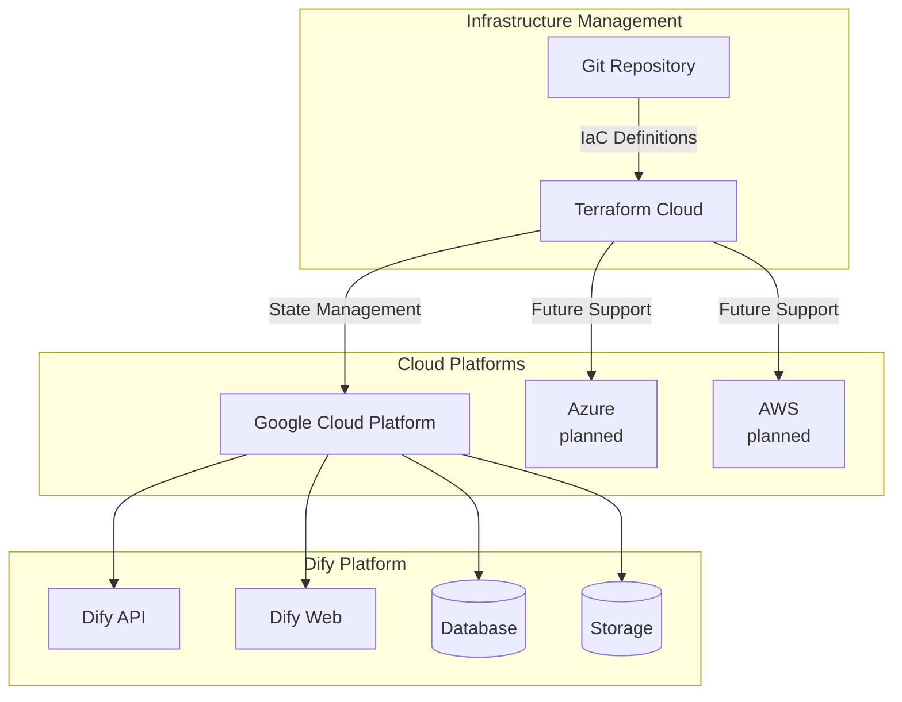
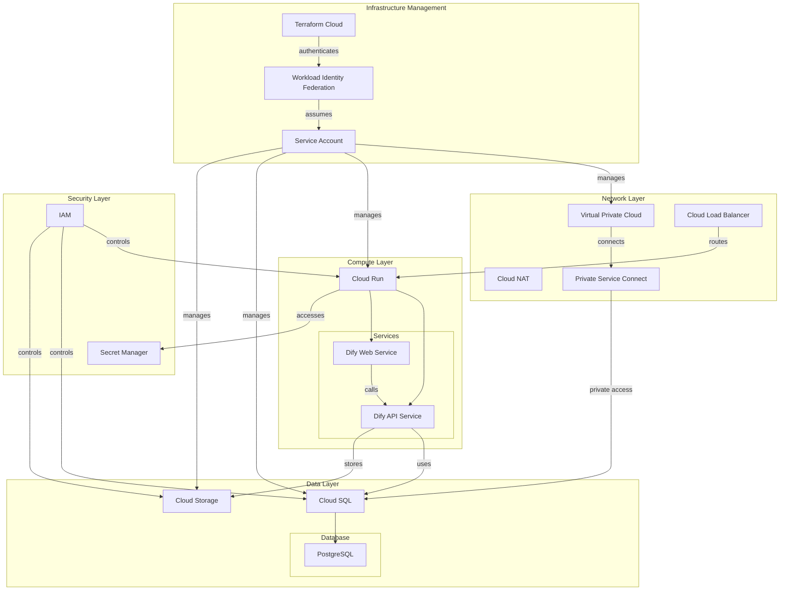

# dify-on-private-cloud

[日本語](README.ja.md) | [English](README.md) | [简体中文](README.zh-cn.md) | [Français](README.fr.md)

A project for setting up a private Dify platform on your cloud infrastructure using Infrastructure as Code.

## Overview

This project provides Infrastructure as Code solutions for deploying Dify in a private cloud environment, with optional secure state management using Terraform Cloud.

### Key Features
- Automated setup of Dify platform on cloud platforms
- Infrastructure as Code using Terraform
  - (Optional) Secure state management with Terraform Cloud
- Designed for organizational use
- Platform-agnostic architecture design
- Secure authentication using Workload Identity Federation (no static credentials)

## Target Users

- Infrastructure administrators
- Organizations seeking IaC solutions for Dify deployment
- Teams using Terraform
- Teams interested in managed Terraform state using Terraform Cloud (optional)

## Architecture

### System Overview


### Detailed Component Architecture (Google Cloud Implementation)


## Project Structure

This repository contains the following components:

1. [Google Cloud Terraform Setup](./dify-google-cloud-terraform/README.md)
   - IaC implementation for Dify on Google Cloud
   - Current reference implementation
   - Detailed deployment instructions
   - Configuration guidelines

2. [Terraform Dynamic Credentials Setup](./terraform-dynamic-credentials-setup/README.md)
   - Optional Terraform Cloud integration
   - Secure credential management
   - State management automation

## Quick Start Guide

### Method 1: Without Terraform Cloud

1. Clone this repository and perform initial setup:
   ```bash
   # Initialize and login to gcloud
   gcloud init --no-launch-browser
   gcloud auth application-default login
   
   # Create GCS bucket for state management
   gsutil mb gs://your-tfstate-bucket
   ```

2. Specify state management bucket in `dify-google-cloud-terraform/terraform/environments/dev/provider.tf`:
   ```hcl
   backend "gcs" {
     bucket = "your-tfstate-bucket" # Replace with your bucket name
     prefix = "dify"
   }
   ```

3. Edit required configuration values in `dify-google-cloud-terraform/terraform/environments/dev/terraform.tfvars`

4. Follow steps 2-6 in dify-google-cloud-terraform's [Getting Started](./dify-google-cloud-terraform/README.md#getting-started)

### Method 2: With Terraform Cloud

1. Prerequisites
   - Create Google Cloud Project
   - Create Organization, Project, and Workspace in Terraform Cloud

2. Clone this repository and edit configuration files
   ```bash
   # Configuration for Dify deployment
   vim dify-google-cloud-terraform/terraform/environments/dev/terraform.tfvars
   
   # Configuration for Terraform Cloud authentication
   vim terraform-dynamic-credentials-setup/gcp/terraform.tfvars
   ```

3. Commit changes and push to repository

4. Configure Workspace in Terraform Cloud
   - Select Version Control Workflow
   - Connect to VCS and specify cloned repository
   - Set Working Directory to `dify-google-cloud-terraform/terraform/environments/dev`

5. Clone repository in Google Cloud Shell and set up authentication
   ```bash
   git clone <your-repository-url>
   cd <repository-name>/terraform-dynamic-credentials-setup
   
   # Connect to Terraform Cloud
   terraform login
   
   # Configure Workload Identity Federation
   cd gcp
   terraform plan
   terraform apply
   ```

6. Execute Run in Terraform Cloud
   - Confirm Plan is automatically executed
   - Approve Apply

For detailed setup instructions, refer to [terraform-dynamic-credentials-setup](./terraform-dynamic-credentials-setup/README.md).

## Supported Platforms

Currently implemented:
- Google Cloud Platform

Future platform support planned:
- Azure
- AWS
- Other major cloud providers

## Contributing

Contributions for adding support for additional cloud platforms are welcome. Please follow the existing implementation patterns and documentation standards.

## Acknowledgments

This project incorporates code from the following open-source projects:

- [dify-google-cloud-terraform](https://github.com/DeNA/dify-google-cloud-terraform) by DeNA (MIT License)
  - Provides the base implementation for Google Cloud deployment
  - Located in `./dify-google-cloud-terraform/`

- [terraform-dynamic-credentials-setup-examples](https://github.com/hashicorp/terraform-dynamic-credentials-setup-examples) by HashiCorp (MPL-2.0 License)
  - Provides the implementation for secure credential management
  - Located in `./terraform-dynamic-credentials-setup/`

## License

This project is licensed under the MIT License - see the [LICENSE](LICENSE) file for details.


